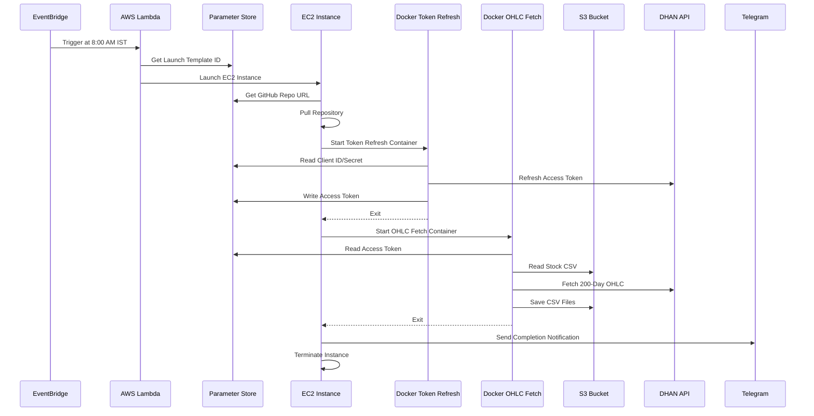

# Trading Data Automation Workflow

## Overview

This repository contains an automated system to retrieve stock **200-day historical OHLC data** and refresh access tokens using the **DHAN API**.  

The workflow leverages:

- AWS EventBridge
- AWS Lambda
- AWS EC2
- Docker (ECR)
- AWS Systems Manager Parameter Store
- Amazon S3
- Python (DHAN SDK + Pandas)
- Telegram Notifications

The system runs automatically every **trading day at 8:00 AM IST**, processes stock data, uploads results to S3, sends notifications, and terminates infrastructure to optimize costs.

---

# Architecture Flow

## Sequence Flow

### 1. Scheduled Trigger

- **AWS EventBridge Scheduler** triggers **AWS Lambda** every trading day at **8:00 AM IST**.
- Lambda orchestrates EC2 instance launch for the automated job.

---

### 2. EC2 Instance Launch

- Lambda retrieves **EC2 Launch Template ID** from **AWS Parameter Store**.
- Lambda launches an EC2 instance using the template.
- The EC2 instance runs a **bootstrap shell script (user-data)** that:
  1. Pulls **GitHub repository URL** from Parameter Store.
  2. Pulls required **Docker images** from AWS ECR.
  3. Executes the first Docker container for token refresh.

---

### 3. Docker Container 1: Token Refresh

- Retrieves **client ID and client secret** from Parameter Store.
- Uses **Python DHAN SDK** to renew the access token.
- Implements **retry logic** (every 2 minutes until successful).
- Once token is retrieved:
  - Writes the access token to Parameter Store.
  - Exits container after completion.

---

### 4. Docker Container 2: OHLC Data Retrieval

- Pulls second Docker image from ECR.
- Retrieves access token from Parameter Store.
- Reads stock list from **S3 CSV file**.
- Uses DHAN SDK to fetch **200-day historical OHLC data**.
- Saves generated CSV files back to S3.

---

### 5. Post-Processing and Cleanup

- Sends Telegram notification indicating job completion.
- EC2 instance automatically terminates using AWS SDK to save costs.

---

# Technologies Used

## AWS Services
- Lambda
- EC2
- EventBridge
- S3
- Systems Manager Parameter Store
- Elastic Container Registry (ECR)

## Containers
- Dockerized Token Refresh Service
- Dockerized OHLC Data Retrieval Service

## Programming
- Python
- DHAN SDK
- Pandas
- Boto3

## Notifications
- Telegram Bot API

---

# Deployment Steps

## 1. EventBridge Scheduler

Configure AWS EventBridge rule:

Example cron for 8:00 AM IST (2:30 UTC):

```
cron(30 2 ? * MON-FRI *)
```

---

## 2. Lambda Function

- Create AWS Lambda to launch EC2 using Launch Template.
- Lambda reads Launch Template ID from Parameter Store.
- Lambda invokes `run_instances()` API.

---

## 3. Parameter Store Setup

Store the following parameters:

- `/trading-bot/github_repo`
- `/trading-bot/dhan_client_id`
- `/trading-bot/dhan_client_secret`
- `/trading-bot/ec2_launch_template`
- `/trading-bot/access_token` (written dynamically)

Use **SecureString** for sensitive parameters.

---

## 4. EC2 Launch Template

Configure:

- IAM Role (S3 + SSM + EC2 terminate permissions)
- Security Group
- Instance Type (e.g., t3.micro)
- User-data bootstrap script

Bootstrap script should:
- Pull code from GitHub
- Login to ECR
- Pull Docker images
- Run containers sequentially

---

## 5. Docker Containers

### Container 1 — Token Refresh

- Retrieve client ID/secret from Parameter Store
- Renew access token using DHAN SDK
- Retry every 2 minutes until successful
- Save access token to Parameter Store
- Exit container

### Container 2 — OHLC Data Fetch

- Retrieve access token from Parameter Store
- Read stock list CSV from S3
- Fetch 200-day OHLC data
- Save generated CSV files to S3

---

## 6. Post-Processing

- Send Telegram notification
- Upload logs (optional)
- Auto-terminate EC2 instance

---

# Sequence Diagram



---

# Workflow Diagram (Text Version)

```
AWS EventBridge (8:00 AM IST)
        |
        v
AWS Lambda
        |
        v
Retrieve Launch Template ID
        |
        v
Launch EC2 Instance
        |
        +---------------------------+
        |                           |
        v                           v
Docker Container 1            Docker Container 2
(Token Refresh)               (OHLC Fetch)
  - Get client ID              - Get access token
  - Renew token                - Read S3 CSV
  - Retry if failed            - Fetch 200-day OHLC
  - Store token                - Save CSV to S3
  - Exit                       - Exit
        |
        v
Send Telegram Notification
        |
        v
Terminate EC2 Instance
```

---

# Security Best Practices

- Use IAM Roles (no hardcoded credentials)
- Store secrets in Parameter Store (SecureString)
- Restrict S3 access to specific IAM role
- Enable CloudWatch logs
- Apply least-privilege principle

---

# Cost Optimization Strategy

- EC2 runs only during execution window
- Automatic termination enabled
- Use small instance type (t3.micro or t3.small)
- Docker containers exit immediately after job completion

---

# Example Repository Structure

```
trading-data-automation/
│
├── lambda/
│   └── launch_ec2.py
│
├── docker/
│   ├── token-refresh/
│   └── ohlc-fetch/
│
├── scripts/
│   └── bootstrap.sh
│
├── requirements.txt
└── README.md
```

---

# Future Enhancements


---

# Author


Cloud-Native | Event-Driven | Cost-Optimized Architecture
